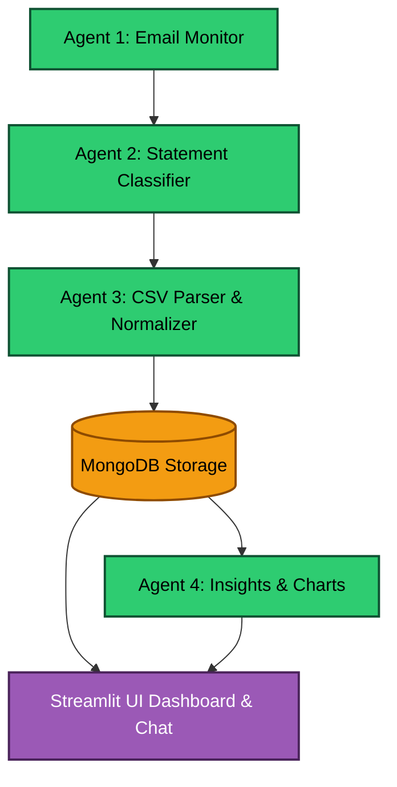

# Finova Application Architecture Diagrams

## System Overview (Existing)

## Detailed Streamlit UI Sequence Diagram

This diagram shows the detailed interactions between components in the Finova Streamlit application.

```mermaid
sequenceDiagram
    participant User
    participant StreamlitApp as Streamlit App
    participant EnvLoader as Environment Loader
    participant MongoTools as Tools/mongo_tools
    participant ChartTools as Tools/chart_tools
    participant CSVTools as Tools/csv_tools
    participant MongoDB as MongoDB Atlas
    participant GeminiAPI as Google Gemini API
    participant FileSystem as File System
    
    Note over User,FileSystem: Application Initialization
    
    User->>StreamlitApp: Launch Application
    StreamlitApp->>EnvLoader: load_dotenv(ENV_PATH)
    EnvLoader->>FileSystem: Read .env file
    FileSystem-->>EnvLoader: Environment variables
    EnvLoader-->>StreamlitApp: Configuration loaded
    
    StreamlitApp->>StreamlitApp: Add PROJECT_ROOT to sys.path
    StreamlitApp->>StreamlitApp: Import Tools modules
    StreamlitApp->>StreamlitApp: Initialize UI config & styling
    
    Note over User,FileSystem: Sidebar Navigation
    
    StreamlitApp->>User: Display sidebar navigation
    User->>StreamlitApp: Select page (Dashboard/Upload/Chat)
    StreamlitApp->>StreamlitApp: Update session_state.page
    
    alt Dashboard Page Selected
        Note over User,FileSystem: Dashboard Flow
        
        StreamlitApp->>StreamlitApp: get_transactions()
        StreamlitApp->>MongoTools: get_mongo_client()
        MongoTools->>EnvLoader: os.getenv("MONGODB_URI")
        EnvLoader-->>MongoTools: MongoDB URI
        MongoTools->>MongoDB: MongoClient(uri)
        MongoDB-->>MongoTools: Client connection
        MongoTools-->>StreamlitApp: MongoDB client
        
        StreamlitApp->>MongoDB: db["transactions"].find({}, {"_id": 0})
        MongoDB-->>StreamlitApp: List of transactions
        
        alt Transactions Found
            StreamlitApp->>ChartTools: generate_insight_charts(transactions)
            ChartTools->>ChartTools: _to_dataframe(transactions)
            ChartTools->>ChartTools: Parse dates & numeric values
            ChartTools->>ChartTools: Calculate summary statistics
            ChartTools->>ChartTools: _infer_category() for each transaction
            ChartTools->>ChartTools: Group by categories & time periods
            
            ChartTools->>FileSystem: plt.savefig() - Balance trend chart
            FileSystem-->>ChartTools: Chart saved
            ChartTools->>FileSystem: plt.savefig() - Category spending chart
            FileSystem-->>ChartTools: Chart saved
            ChartTools-->>StreamlitApp: summary_data, chart_paths
            
            StreamlitApp->>StreamlitApp: _fmt_inr() - Format currency
            StreamlitApp->>StreamlitApp: _metric_card() - Generate HTML cards
            StreamlitApp->>User: Display financial metrics
            StreamlitApp->>User: Display spending categories
            StreamlitApp->>User: Display charts
        else No Transactions
            StreamlitApp->>User: Display warning "No transactions found"
        end
        
    else Upload Page Selected
        Note over User,FileSystem: File Upload Flow
        
        StreamlitApp->>User: Display file uploader
        User->>StreamlitApp: Upload CSV file
        
        StreamlitApp->>CSVTools: parse_statement_csv(uploaded_file, bank_name, account_id)
        CSVTools->>CSVTools: pd.read_csv(uploaded_file)
        CSVTools->>CSVTools: Normalize column names
        CSVTools->>CSVTools: find_column() - Map to standard fields
        CSVTools->>CSVTools: Clean & validate data
        CSVTools->>CSVTools: Convert to transaction format
        CSVTools-->>StreamlitApp: parsed["transactions"]
        
        StreamlitApp->>MongoTools: get_mongo_client()
        MongoTools->>MongoDB: Connect to database
        MongoDB-->>MongoTools: Connection established
        MongoTools-->>StreamlitApp: MongoDB client
        
        StreamlitApp->>MongoDB: Get db[FINOVA_DB_NAME]
        StreamlitApp->>MongoDB: Get transactions & uploaded_files collections
        
        loop For each transaction
            StreamlitApp->>MongoDB: col.insert_one(tx)
            MongoDB-->>StreamlitApp: Insert confirmation
        end
        
        StreamlitApp->>MongoDB: uploads_col.insert_one(upload_metadata)
        MongoDB-->>StreamlitApp: Upload record saved
        StreamlitApp->>User: Display success message
        
        Note over StreamlitApp,MongoDB: Display Upload History
        StreamlitApp->>MongoDB: uploads_col.find().sort().limit(5)
        MongoDB-->>StreamlitApp: Recent upload records
        StreamlitApp->>User: Display recent uploads list
        
    else Chat Page Selected
        Note over User,GeminiAPI: Chat Flow
        
        StreamlitApp->>StreamlitApp: get_transactions()
        StreamlitApp->>MongoTools: get_mongo_client()
        MongoTools->>MongoDB: Fetch transactions
        MongoDB-->>StreamlitApp: Transaction data
        
        alt Transactions Available
            StreamlitApp->>StreamlitApp: Initialize chat_history in session_state
            StreamlitApp->>User: Display chat history
            StreamlitApp->>User: Display chat input
            
            User->>StreamlitApp: Enter question/message
            StreamlitApp->>StreamlitApp: Add user message to chat_history
            StreamlitApp->>User: Display user message
            
            StreamlitApp->>StreamlitApp: answer_question_with_llm(question, transactions)
            
            alt Chart Keywords Detected
                Note over StreamlitApp,FileSystem: Chart Generation Path
                StreamlitApp->>StreamlitApp: pd.DataFrame(transactions)
                StreamlitApp->>StreamlitApp: Process dates & group by month
                StreamlitApp->>StreamlitApp: plt.figure() & plt.plot()
                StreamlitApp->>FileSystem: plt.savefig("generated_chart.png")
                FileSystem-->>StreamlitApp: Chart file saved
                StreamlitApp-->>StreamlitApp: Return chart response
            else Text Query
                Note over StreamlitApp,GeminiAPI: LLM Processing Path
                StreamlitApp->>StreamlitApp: get_gemini_client()
                StreamlitApp->>EnvLoader: os.getenv("GOOGLE_API_KEY")
                EnvLoader-->>StreamlitApp: API key
                StreamlitApp->>GeminiAPI: Client(api_key)
                GeminiAPI-->>StreamlitApp: Gemini client
                
                StreamlitApp->>StreamlitApp: Construct prompt with question & transactions
                StreamlitApp->>GeminiAPI: client.models.generate_content()
                GeminiAPI-->>StreamlitApp: AI response
                StreamlitApp-->>StreamlitApp: Return text response
            end
            
            StreamlitApp->>User: Display AI response
            StreamlitApp->>StreamlitApp: Add response to chat_history
            
        else No Transactions
            StreamlitApp->>User: Display warning "Upload a CSV first"
        end
    end
    
    Note over User,FileSystem: Error Handling
    
    alt MongoDB Connection Failed
        MongoTools->>StreamlitApp: Raise ValueError
        StreamlitApp->>User: Display connection error
    end
    
    alt Gemini API Failed
        GeminiAPI->>StreamlitApp: Return exception
        StreamlitApp->>StreamlitApp: Return error string
        StreamlitApp->>User: Display API error
    end
    
    alt CSV Parse Failed
        CSVTools->>StreamlitApp: Raise Exception
        StreamlitApp->>User: Display parse error
    end
```

## Key Components and Their Responsibilities:

### 1. **StreamlitApp (Main Orchestrator)**
- Handles UI routing and page management
- Manages session state and user interactions  
- Coordinates between different tools and services

### 2. **MongoTools**
- Provides MongoDB Atlas connectivity
- Handles database operations for transactions and uploads
- Manages connection pooling and authentication

### 3. **ChartTools**
- Generates financial insights and visualizations
- Processes transaction data into meaningful metrics
- Creates matplotlib charts for dashboard display

### 4. **CSVTools**
- Parses uploaded CSV files from various banks
- Normalizes column names and data formats
- Converts raw data into standardized transaction format

### 5. **External Services**
- **MongoDB Atlas**: Persistent storage for transactions and metadata
- **Google Gemini API**: AI-powered chat functionality
- **File System**: Chart generation and temporary file storage

## Data Flow Patterns:

1. **Initialization**: Environment loading → Path setup → Module imports → UI configuration
2. **Dashboard**: Data retrieval → Processing → Visualization → Display
3. **Upload**: File parsing → Data validation → Database insertion → Confirmation
4. **Chat**: Query processing → AI/Chart generation → Response formatting → Display

## Error Handling:
- Database connectivity issues
- API authentication failures  
- File parsing errors
- Missing environment variables

