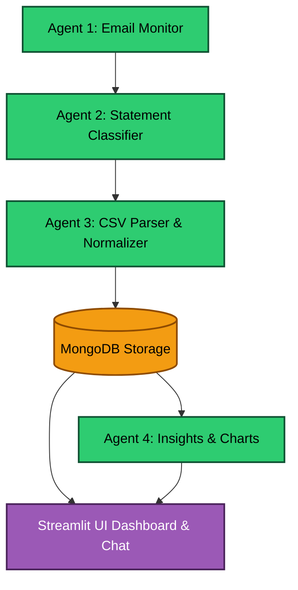

```mermaid
flowchart TD

    %% === Pipeline Agents ===
    A1[Agent 1: Email Monitor] --> A2[Agent 2: Statement Classifier]
    A2 --> A3[Agent 3: CSV Parser & Normalizer]

    %% === Storage ===
    A3 --> DB[(MongoDB Storage)]

    %% === Consumers ===
    DB --> A4[Agent 4: Insights & Charts]
    DB --> UI[Streamlit UI Dashboard & Chat]

    %% === Insights to UI ===
    A4 --> UI

%% === Colors for Dark Theme ===
    %% Agents (Bright Green)
    style A1 fill:#2ecc71,stroke:#0f5132,stroke-width:2px,color:#000
    style A2 fill:#2ecc71,stroke:#0f5132,stroke-width:2px,color:#000
    style A3 fill:#2ecc71,stroke:#0f5132,stroke-width:2px,color:#000
    style A4 fill:#2ecc71,stroke:#0f5132,stroke-width:2px,color:#000

    %% Database (Bright Orange)
    style DB fill:#f39c12,stroke:#8e4b01,stroke-width:2px,color:#000

    %% UI (Neon Purple)
    style UI fill:#9b59b6,stroke:#4a235a,stroke-width:2px,color:#fff

```

